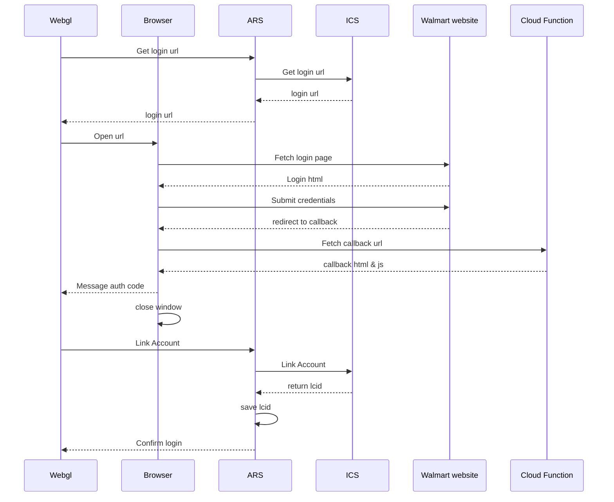

# WebGL Redirect

In order to pass control back to a WebGL build after login, Walmart needs to redirect to a middle-man page that passes the auth code back to the SDK.

This basic script is an example of a GCP Cloud Function that takes the code and nonce parameters from the Walmart callback and calls the SDK via javascript.

Good sample documentation, [Login flow for Unity WebGL applications](https://developer.okta.com/blog/2021/02/26/unity-webgl-playfab-authorization).
