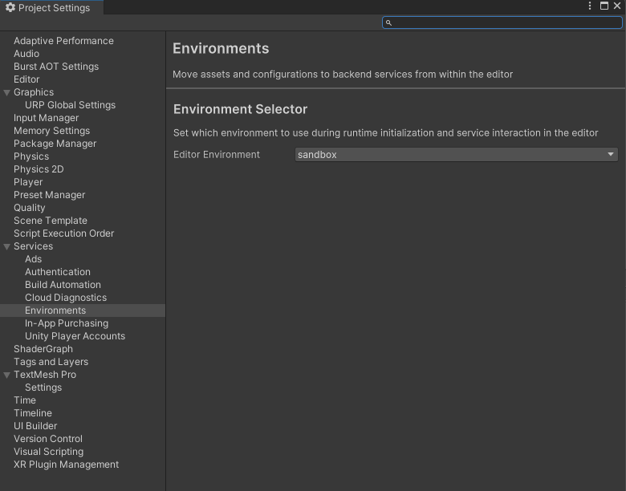

# Sandbox Testing

## Table of Contents

- [Motivation](#motivation)
- [Requirements](#requirements)
- [Sandbox Testing Setup](#sandbox-testing-setup)
  - [Deploy sandbox environment](#deploy-sandbox-environment)
  - [Testing with sandbox environment](#testing-with-sandbox-environment)

## Motivation
Sandbox testing allows for full end-to-end integration testing, including the purchasing flow, without making actual transactions on Walmart.com.

## Requirements

Before starting sandbox testing, ensure you have:

1. A walmart.com account 
2. A credit card associated with the account (**Note:** No charges will be made while testing in the sandbox environment)
3. Unity Gaming Services CLI installed and configured
4. A Unity project with UGS environment configured

## Sandbox Testing Setup

### Deploy sandbox environment

To deploy using the ICS sandbox environment:

1. **Create a new environment in the UGS Dashboard:**
   - Navigate to your project in the UGS Dashboard
   - Go to the Environments section
   - Create a new environment (e.g., "sandbox")

2. **Configure your local environment:**
   ```bash
   ugs config set environment-name <your-sandbox-environment-name>
   ```

3. **Update the remote configuration:**
   Before deploying, update your `configuration.rc` file by setting `WALMART_ICS_SANDBOX` to `true`:
   ```json
   {
     "entries": {
       "WALMART_ICS_SANDBOX": "true",
       // ... other configuration values
     }
   }
   ```

4. **Deploy to the sandbox environment:**
   ```bash
   ugs deploy .
   ```

#### Verify Deployment

You can verify deployment and configuration is set up properly in the UGS dashboard:

1. Go to Remote Config → Config
2. Select the sandbox environment name that you deployed above
3. Verify that the `WALMART_ICS_SANDBOX` value is set to `true`

### Testing with sandbox environment

To generate a bearer token for the player, include the `UnityEnvironment` header in the request, using the environment name as the value. This ensures that the test runs in the sandbox environment without triggering actual payment flows.

#### Code Integration Example

Assuming the sandbox environment is named "sandbox":

```csharp
InitializationOptions initializationOptions = new InitializationOptions();
initializationOptions.SetOption("com.unity.services.core.environment-name", "sandbox");
await UnityServices.InitializeAsync(initializationOptions);
```

#### Unity Editor Configuration

If testing in the Unity Editor:

1. Open Project Settings (Edit Menu → Project Settings)
2. Navigate to Environments under Services
3. Select "sandbox" under Editor Environment



#### Additional Testing Notes

- All API calls will use sandbox endpoints when `WALMART_ICS_SANDBOX` is set to `true`
- Test transactions will not result in actual charges
- You can use real Walmart account credentials for testing
- Order placement will simulate the full flow without processing payments
